csdn博客 https://blog.csdn.net/sinat_38292017


# Flink   CheckPoint机制

## 1、实验目的

### 目的

开启一个Flink程序，使用hdfs做状态后端，手动取消job后，再次恢复job测试，观察程序是否能恢复到检查点，继续读取并处理数据；


### 实验原理：检查点机制

​	当程序出现问题需要恢复 Sate 数据的时候，只有程序提供支持才可以实现 State 的容

错。State 的容错需要依靠 CheckPoint 机制，这样才可以保证 Exactly-once 这种语义，但

是注意，它只能保证 Flink 系统内的 Exactly-once，比如 Flink 内置支持的算子。针对 Source

和 Sink 组件，如果想要保证 Exactly-once 的话，则这些组件本身应支持这种语义。

 

​	Flink 中基于异步轻量级的分布式快照技术提供了 Checkpoints 容错机制，分布式快照

可以将同一时间点 Task/Operator 的状态数据全局统一快照处理，包括前面提到的 Keyed

State 和 Operator State。Flink 会在输入的数据集上间隔性地生成 checkpoint barrier，

通过栅栏（barrier）将间隔时间段内的数据划分到相应的 checkpoint 中。如下图：

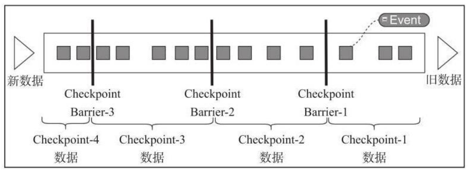

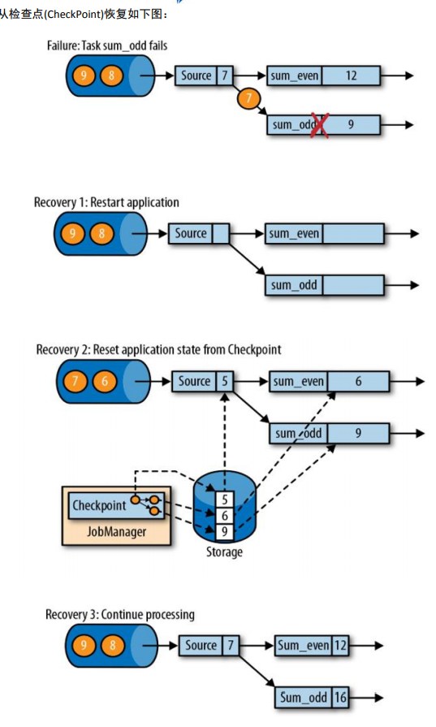


##  FsStateBackend 状态后端

​	和 MemoryStateBackend 有所不同，FsStateBackend 是基于文件系统的一种状态管理器，这里的文件系统可以是本地文件系统，也可以是 HDFS 分布式文件系统。FsStateBackend 更适合任务状态非常大的情况，例如应用中含有时间范围非常长的窗口计算，或 Key/value State 状态数据量非常大的场景。

缺点：存在突然出现大量数据在TaskManager时候保存在jvm内存中，还是会溢出的问题。


## 2、实验过程

### 实验环境

Idea开发环境；

CentOS Linux release 7.5.1804 (Core)

引用pom中的环境内容：

```xml
<flink.version>1.9.2</flink.version>
<java.version>1.8</java.version>
<scala.binary.version>2.11</scala.binary.version>
<hadoop.version>2.7.7</hadoop.version>
<maven.compiler.source>${hadoop.version}</maven.compiler.source>
<maven.compiler.source>${flink.version}</maven.compiler.source>
<maven.compiler.target>${java.version}</maven.compiler.target>
```

### 对job配置检查点

```java
//——————————开启一个checkpoint并且设置一些参数——————————
//每隔5s开启一个checkpoint
env.enableCheckpointing(5000);
//使用FsStateBackend 存放检查点数据
env.setStateBackend(new FsStateBackend("hdfs://slave1:8020/checkpoint/cp2"));
//—————————官网拿来的参数———————getCheckpointConfig———————————————
// set mode to exactly-once (this is the default)
env.getCheckpointConfig().setCheckpointingMode(CheckpointingMode.EXACTLY_ONCE);
// make sure 500 ms of progress happen between checkpoints
env.getCheckpointConfig().setMinPauseBetweenCheckpoints(500);
// checkpoints have to complete within one minute, or are discarded
env.getCheckpointConfig().setCheckpointTimeout(60000);
// allow only one checkpoint to be in progress at the same time
env.getCheckpointConfig().setMaxConcurrentCheckpoints(1);
// enable externalized checkpoints which are retained after job cancellation
env.getCheckpointConfig().enableExternalizedCheckpoints(CheckpointConfig.ExternalizedCheckpointCleanup.RETAIN_ON_CANCELLATION);
//连接socket获取输入的数据

```


也可以通过对flink-cofig.yml配置对全局配置，但是一般不建议；


### source ——transformation——sink

```java
        //连接socket获取输入的数据
        DataStreamSource<String> text = env.socketTextStream("192.168.242.150", 8888, "\n");

        //计算数据
        DataStream<Tuple2<String, Integer>> counts = text
                .flatMap(new FlatMapFunction<String, Tuple2<String,Integer>>() {
                    @Override
                    public void flatMap(String s, Collector<Tuple2<String, Integer>> collector) throws Exception {
                        for (String word: s.split(" ")){
                            collector.collect(new Tuple2<>(word,1));
                        }
                    }
                })
                .keyBy(0)
                .sum(1);
        counts.print();
        env.execute();

```

### 启动环境

现需要启动hadoop（启动hdfs即可），然后启动flink环境；

​	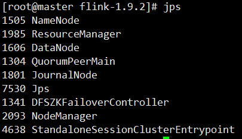

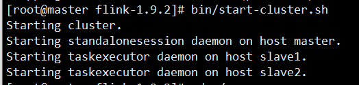

检查hdfs文件系统中是否存在检查点目录（测试），如果存在需要先清掉；

```hdfs dfs -rm -r /checkpoint``` 

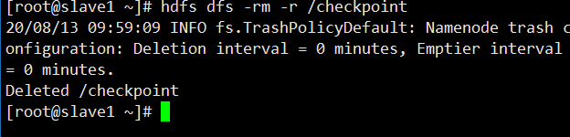

程序写好后打包提交到Flink上，使用FlinkUI做提交上传打包后的jar程序;

### 恢复检查点

找到Flink检查点位置，进入到hadoop webUI；

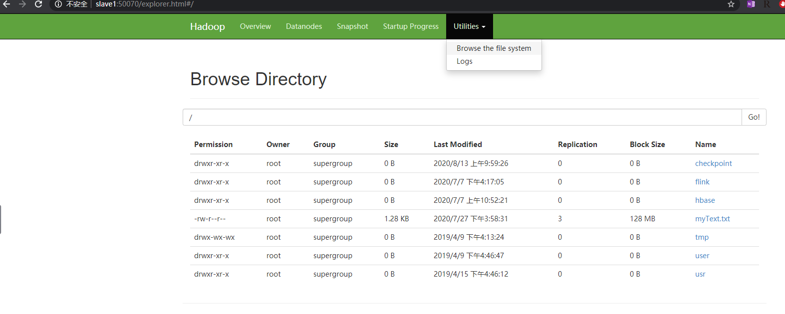

找到_metadata，检查点数据存放目录；

为后面恢复提供目录信息

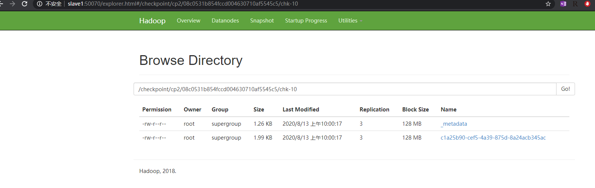

#### 1、Flink UI恢复检查点

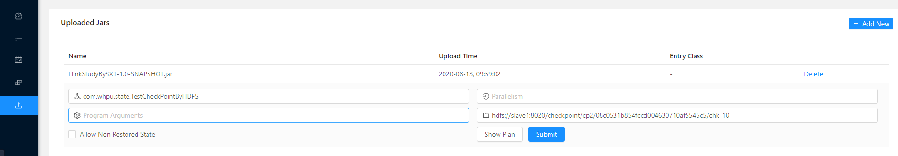

#### 2、在linux命令行启动Flink程序，恢复检查点；

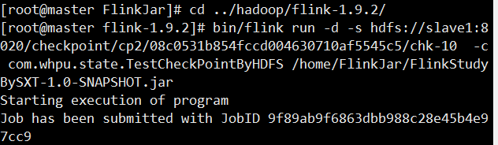

```bin/flink run -d -s hdfs://slave1:8020/checkpoint/cp2/08c0531b854fccd004630710af5545c5/chk-10  -c com.whpu.state.TestCheckPointByHDFS /home/FlinkJar/FlinkStudyBySXT-1.0-SNAPSHOT.jar```


## 3、实验结果

使用NETCAT发送数据，flink程序能够继续读取，并处理数据；

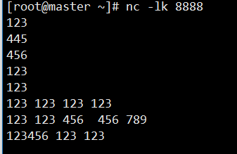

flink UI

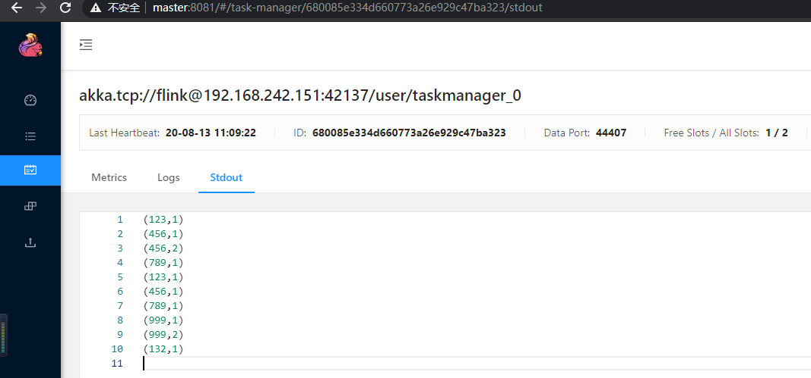


### 相关程序

#### checkpoint代码

```java
package com.whpu.state;

import com.whpu.WordCountPi;
import org.apache.flink.api.common.functions.FlatMapFunction;
import org.apache.flink.api.java.tuple.Tuple2;
import org.apache.flink.runtime.state.filesystem.FsStateBackend;
import org.apache.flink.streaming.api.CheckpointingMode;
import org.apache.flink.streaming.api.datastream.DataStream;
import org.apache.flink.streaming.api.datastream.DataStreamSource;
import org.apache.flink.streaming.api.environment.CheckpointConfig;
import org.apache.flink.streaming.api.environment.StreamExecutionEnvironment;
import org.apache.flink.streaming.api.windowing.time.Time;
import org.apache.flink.util.Collector;

/**
 * @author cc
 * @create 2020-08-11-16:02
 * 需求：CheckPoint案例实现，使用hdfs做状态后端，取消job后再次恢复job测试；
 */
public class TestCheckPointByHDFS {
    public static void main(String[] args) throws Exception {
        //获取运行环境
        StreamExecutionEnvironment env = StreamExecutionEnvironment.getExecutionEnvironment();

        //——————————开启一个checkpoint并且设置一些参数——————————
        //每隔5s开启一个checkpoint
        env.enableCheckpointing(5000);
        //使用FsStateBackend 存放检查点数据
        env.setStateBackend(new FsStateBackend("hdfs://slave1:8020/checkpoint/cp2"));
        //——————————————————————官网拿来的参数———————getCheckpointConfig———————————————
        // set mode to exactly-once (this is the default)
        env.getCheckpointConfig().setCheckpointingMode(CheckpointingMode.EXACTLY_ONCE);
        // make sure 500 ms of progress happen between checkpoints
        env.getCheckpointConfig().setMinPauseBetweenCheckpoints(500);
        // checkpoints have to complete within one minute, or are discarded
        env.getCheckpointConfig().setCheckpointTimeout(60000);
        // allow only one checkpoint to be in progress at the same time
        env.getCheckpointConfig().setMaxConcurrentCheckpoints(1);
        // enable externalized checkpoints which are retained after job cancellation
        env.getCheckpointConfig().enableExternalizedCheckpoints(CheckpointConfig.ExternalizedCheckpointCleanup.RETAIN_ON_CANCELLATION);
        //连接socket获取输入的数据
        DataStreamSource<String> text = env.socketTextStream("192.168.242.150", 8888, "\n");

        //计算数据
        DataStream<Tuple2<String, Integer>> counts = text
                .flatMap(new FlatMapFunction<String, Tuple2<String,Integer>>() {
                    @Override
                    public void flatMap(String s, Collector<Tuple2<String, Integer>> collector) throws Exception {
                        for (String word: s.split(" ")){
                            collector.collect(new Tuple2<>(word,1));
                        }
                    }
                })
                .keyBy(0)
                .sum(1);
        counts.print();
        env.execute();

    }
}
```

pom.xml

```xml
<!--
Licensed to the Apache Software Foundation (ASF) under one
or more contributor license agreements.  See the NOTICE file
distributed with this work for additional information
regarding copyright ownership.  The ASF licenses this file
to you under the Apache License, Version 2.0 (the
"License"); you may not use this file except in compliance
with the License.  You may obtain a copy of the License at

  http://www.apache.org/licenses/LICENSE-2.0

Unless required by applicable law or agreed to in writing,
software distributed under the License is distributed on an
"AS IS" BASIS, WITHOUT WARRANTIES OR CONDITIONS OF ANY
KIND, either express or implied.  See the License for the
specific language governing permissions and limitations
under the License.
-->
<project xmlns="http://maven.apache.org/POM/4.0.0" xmlns:xsi="http://www.w3.org/2001/XMLSchema-instance"
   xsi:schemaLocation="http://maven.apache.org/POM/4.0.0 http://maven.apache.org/xsd/maven-4.0.0.xsd">
   <modelVersion>4.0.0</modelVersion>

   <groupId>com.whpu</groupId>
   <artifactId>FlinkStudyBySXT</artifactId>
   <version>1.0-SNAPSHOT</version>
   <packaging>jar</packaging>

   <name>Flink Quickstart Job</name>
   <url>http://www.myorganization.org</url>

   <properties>
      <project.build.sourceEncoding>UTF-8</project.build.sourceEncoding>
      <flink.version>1.9.2</flink.version>
      <java.version>1.8</java.version>
      <scala.binary.version>2.11</scala.binary.version>
      <hadoop.version>2.7.7</hadoop.version>
      <maven.compiler.source>${hadoop.version}</maven.compiler.source>
      <maven.compiler.source>${flink.version}</maven.compiler.source>
      <maven.compiler.target>${java.version}</maven.compiler.target>
   </properties>

   <repositories>
      <repository>
         <id>apache.snapshots</id>
         <name>Apache Development Snapshot Repository</name>
         <url>https://repository.apache.org/content/repositories/snapshots/</url>
         <releases>
            <enabled>false</enabled>
         </releases>
         <snapshots>
            <enabled>true</enabled>
         </snapshots>
      </repository>
   </repositories>

   <dependencies>
      <!-- Apache Flink dependencies -->
      <!-- These dependencies are provided, because they should not be packaged into the JAR file. -->
      <dependency>
         <groupId>org.apache.flink</groupId>
         <artifactId>flink-java</artifactId>
         <version>${flink.version}</version>
         <scope>provided</scope>
      </dependency>
      <dependency>
         <groupId>org.apache.flink</groupId>
         <artifactId>flink-streaming-java_${scala.binary.version}</artifactId>
         <version>${flink.version}</version>
         <scope>provided</scope>
      </dependency>

      <dependency>
         <groupId>org.apache.flink</groupId>
         <artifactId>flink-core</artifactId>
         <version>${flink.version}</version>
      </dependency>
      <dependency>
         <groupId>org.apache.flink</groupId>
         <artifactId>flink-clients_2.11</artifactId>
         <version>${flink.version}</version>
      </dependency>


      <!-- Add connector dependencies here. They must be in the default scope (compile). -->

      <!-- Example:

        <dependency>
            <groupId>org.apache.flink</groupId>
            <artifactId>flink-connector-kafka-0.10_${scala.binary.version}</artifactId>
            <version>${flink.version}</version>
        </dependency>
        -->

      <!-- Add logging framework, to produce console output when running in the IDE. -->
      <!-- These dependencies are excluded from the application JAR by default. -->
      <dependency>
         <groupId>org.slf4j</groupId>
         <artifactId>slf4j-log4j12</artifactId>
         <version>1.7.7</version>
         <scope>runtime</scope>
      </dependency>
      <dependency>
         <groupId>log4j</groupId>
         <artifactId>log4j</artifactId>
         <version>1.2.17</version>
         <scope>runtime</scope>
      </dependency>

      <dependency>
         <groupId>org.apache.hadoop</groupId>
         <artifactId>hadoop-common</artifactId>
         <version>${hadoop.version}</version>
      </dependency>
      <dependency>
         <groupId>org.apache.hadoop</groupId>
         <artifactId>hadoop-client</artifactId>
         <version>${hadoop.version}</version>
      </dependency>
      <dependency>
         <groupId>org.apache.hadoop</groupId>
         <artifactId>hadoop-hdfs</artifactId>
         <version>${hadoop.version}</version>
         <exclusions>
         <exclusion>
            <groupId>xml-apis</groupId>
            <artifactId>xml-apis</artifactId>
         </exclusion>
         </exclusions>
      </dependency>


      <dependency>
         <groupId>org.apache.flink</groupId>
         <artifactId>flink-connector-kafka-0.11_${scala.binary.version}</artifactId>
         <version>${flink.version}</version>
      </dependency>
      <!--连接HDFS的sink依赖-->
      <dependency>
         <groupId>org.apache.flink</groupId>
         <artifactId>flink-connector-filesystem_${scala.binary.version}</artifactId>
         <version>${flink.version}</version>
      </dependency>
      <dependency>
         <groupId>org.apache.kafka</groupId>
         <artifactId>kafka-clients</artifactId>
         <version>0.11.0.2</version>
      </dependency>
      <dependency>
         <groupId>org.apache.bahir</groupId>
         <artifactId>flink-connector-redis_${scala.binary.version}</artifactId>
         <version>1.0</version>
      </dependency>
      <dependency>
         <groupId>mysql</groupId>
         <artifactId>mysql-connector-java</artifactId>
         <version>5.1.47</version>
      </dependency>

      <dependency>
         <groupId>org.apache.flink</groupId>
         <artifactId>flink-statebackend-rocksdb_2.11</artifactId>
         <version>${flink.version}</version>
      </dependency>

   </dependencies>

   <build>
      <plugins>

         <!-- Java Compiler -->
         <plugin>
            <groupId>org.apache.maven.plugins</groupId>
            <artifactId>maven-compiler-plugin</artifactId>
            <version>3.1</version>
            <configuration>
               <source>${java.version}</source>
               <target>${java.version}</target>
            </configuration>
         </plugin>

         <!-- We use the maven-shade plugin to create a fat jar that contains all necessary dependencies. -->
         <!-- Change the value of <mainClass>...</mainClass> if your program entry point changes. -->
         <plugin>
            <groupId>org.apache.maven.plugins</groupId>
            <artifactId>maven-shade-plugin</artifactId>
            <version>3.0.0</version>
            <executions>
               <!-- Run shade goal on package phase -->
               <execution>
                  <phase>package</phase>
                  <goals>
                     <goal>shade</goal>
                  </goals>
                  <configuration>
                     <artifactSet>
                        <excludes>
                           <exclude>org.apache.flink:force-shading</exclude>
                           <exclude>com.google.code.findbugs:jsr305</exclude>
                           <exclude>org.slf4j:*</exclude>
                           <exclude>log4j:*</exclude>
                        </excludes>
                     </artifactSet>
                     <filters>
                        <filter>
                           <!-- Do not copy the signatures in the META-INF folder.
                           Otherwise, this might cause SecurityExceptions when using the JAR. -->
                           <artifact>*:*</artifact>
                           <excludes>
                              <exclude>META-INF/*.SF</exclude>
                              <exclude>META-INF/*.DSA</exclude>
                              <exclude>META-INF/*.RSA</exclude>
                           </excludes>
                        </filter>
                     </filters>
                  </configuration>
               </execution>
            </executions>
         </plugin>
      </plugins>

      <pluginManagement>
         <plugins>

            <!-- This improves the out-of-the-box experience in Eclipse by resolving some warnings. -->
            <plugin>
               <groupId>org.eclipse.m2e</groupId>
               <artifactId>lifecycle-mapping</artifactId>
               <version>1.0.0</version>
               <configuration>
                  <lifecycleMappingMetadata>
                     <pluginExecutions>
                        <pluginExecution>
                           <pluginExecutionFilter>
                              <groupId>org.apache.maven.plugins</groupId>
                              <artifactId>maven-shade-plugin</artifactId>
                              <versionRange>[3.0.0,)</versionRange>
                              <goals>
                                 <goal>shade</goal>
                              </goals>
                           </pluginExecutionFilter>
                           <action>
                              <ignore/>
                           </action>
                        </pluginExecution>
                        <pluginExecution>
                           <pluginExecutionFilter>
                              <groupId>org.apache.maven.plugins</groupId>
                              <artifactId>maven-compiler-plugin</artifactId>
                              <versionRange>[3.1,)</versionRange>
                              <goals>
                                 <goal>testCompile</goal>
                                 <goal>compile</goal>
                              </goals>
                           </pluginExecutionFilter>
                           <action>
                              <ignore/>
                           </action>
                        </pluginExecution>
                     </pluginExecutions>
                  </lifecycleMappingMetadata>
               </configuration>
            </plugin>
         </plugins>
      </pluginManagement>
   </build>

   <!-- This profile helps to make things run out of the box in IntelliJ -->
   <!-- Its adds Flink's core classes to the runtime class path. -->
   <!-- Otherwise they are missing in IntelliJ, because the dependency is 'provided' -->
   <profiles>
      <profile>
         <id>add-dependencies-for-IDEA</id>

         <activation>
            <property>
               <name>idea.version</name>
            </property>
         </activation>

         <dependencies>
            <dependency>
               <groupId>org.apache.flink</groupId>
               <artifactId>flink-java</artifactId>
               <version>${flink.version}</version>
               <scope>compile</scope>
            </dependency>
            <dependency>
               <groupId>org.apache.flink</groupId>
               <artifactId>flink-streaming-java_${scala.binary.version}</artifactId>
               <version>${flink.version}</version>
               <scope>compile</scope>
            </dependency>
         </dependencies>
      </profile>
   </profiles>

</project>
```


## 4、总结

### 1、程序中 hadoop版本问题

在程序启动后能够处理数据，并print出正确结果，但是在hdfs上没有出现 _metadata文件

检查程序中的hadoop版本还是之前的2.6.5，没有和服务器上的hadoop一起更新，hadoop版本是2.7.7，修改后，程序正常运行。

```java
<hadoop.version>2.6.5</hadoop.version>
<maven.compiler.source>${hadoop.version}</maven.compiler.source>
```

替换成以下内容

```java
<hadoop.version>2.7.7</hadoop.version>
<maven.compiler.source>${hadoop.version}</maven.compiler.source>
```

这个坑算是比较难受的。

### 2、在flink的日志中找到报错：

```java
javax.xml.parsers.FactoryConfigurationError: Provider for class javax.xml.parsers.DocumentBuilderFactory cannot be created
java.lang.RuntimeException: Provider for class javax.xml.parsers.DocumentBuilderFactory cannot be created
javax.xml.parsers.DocumentBuilderFactory: Provider org.apache.xerces.jaxp.DocumentBuilderFactoryImpl not a subtype
```

在以上pom文件中需要注意的是，hadoop的配置会导致引入一个xml-apis. jar包；通过查阅网上信息了解到需要去掉才可，如下配置

```java
<dependency>
   <groupId>org.apache.hadoop</groupId>
   <artifactId>hadoop-hdfs</artifactId>
   <version>${hadoop.version}</version>
   <exclusions>
   <exclusion>
      <groupId>xml-apis</groupId>
      <artifactId>xml-apis</artifactId>
   </exclusion>
   </exclusions>
</dependency>
```

### 3、小结

其实程序本身并不复杂，无非就是几个配置项，但是可能自己对flink提交任务还是不够熟练，对错误无法精准定位，导致简单的问题卡很久；checkpoint这块主要还是要理解flink处理原理；


### 代码github地址：

https://github.com/Cc-a23187/FlinkStudyBySXT
:raised_hands:  :point_right::star::star:
